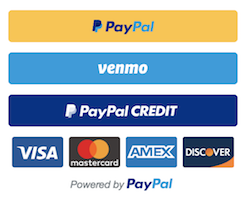

# :large_blue_diamond: react-paypal-button-v2



> An easy and simple to use React button component to implement PayPal&#39;s Checkout with Smart Payment Buttons V2 (Version 2).

> Check out the [docs](https://luehangs.site/lue_hang/projects/react-paypal-button-v2) for a complete documentation.

:information_source: This PayPal Checkout integration uses the PayPal JavaScript SDK.  Starting at the beginning of February 2019, all new users must use PayPal's version 2 integration as version 1 is now depreciated.

<br/>
<br/>
<br/>
<a href="https://luehangs.site"></a>
<br/>
<br/>
<br/>

# Index

### 1.  [Prerequisites](#large_blue_diamond-prerequisites)
### 2.  [Install](#large_blue_diamond-install)
### 3.  [Usage Example](#large_blue_diamond-usage-example)
### 4.  [Production Example](#large_blue_diamond-production-example)
### 5.  [API](#large_blue_diamond-api)
### 6.  :books: [Props](#large_blue_diamond-props)
### 7.  [`options` Prop Fieldnames/Parameters](#small_blue_diamond-options-prop-fieldnames-or-parameters)
### 8.  [Alternative Usage Example](#large_blue_diamond-alternative-usage-example)
### 9.  [Alternative Production Example](#large_blue_diamond-alternative-production-example)
### 10. [Example Project](#large_blue_diamond-example-project)
### 11. [Contribute](#large_blue_diamond-contribute)
### 12. [License](#large_blue_diamond-license)

<br/>
<br/>
<br/>

---
<br/>
<br/>
<br/>

## :large_blue_diamond: Prerequisites

To use PayPal's Smart Payment Buttons in prodution, you must have a PayPal Business account set up and verified. After this is done, you'll have access to your API credentials to use with this button.

Once you have your account set up, you will have 2 different sets of credentials for sandbox mode and production mode. You will also be able to create sandbox business and customer accounts to be tested on.

<br/>
<br/>
<br/>
<a href="https://luehangs.site/marketplace/product/RN%20Posting%20Demo%20App%20Kit"></a>
<br/>
<br/>
<br/>

## :large_blue_diamond: Install

Type in the following to the command line to install the dependency. 

```sh
$ npm install react-paypal-button-v2 --save
```

or

```sh
$ yarn add react-paypal-button-v2
```

<br/>
<br/>
<br/>

---
<br/>
<br/>
<br/>

## :large_blue_diamond: Usage Example

Add an ``import`` to the top of the file.  **At minimal**, declare the ``PayPalButton`` component in the ``render()`` method providing a string for the `amount` prop and a function to the `onSuccess` prop.

> If you like [`react-paypal-button-v2`](https://github.com/Luehang/react-paypal-button-v2), please be sure to give it a star at [GitHub](https://github.com/Luehang/react-paypal-button-v2). Thanks.

```javascript
import { PayPalButton } from "react-paypal-button-v2";

export default class Example Component {
  render() {
    return (
      <PayPalButton
        amount="0.01"
        // shippingPreference="NO_SHIPPING" // default is "GET_FROM_FILE"
        onSuccess={(details, data) => {
          alert("Transaction completed by " + details.payer.name.given_name);

          // OPTIONAL: Call your server to save the transaction
          return fetch("/paypal-transaction-complete", {
            method: "post",
            body: JSON.stringify({
              orderID: data.orderID
            })
          });
        }}
      />
    );
  }
}
```

For alternative usage, go to the [Alternative Usage Example Section](#large_blue_diamond-alternative-usage-example).

To create subscriptions, go to the [Subscriptions Example Section](#subscription-example-usage).

<br/>
<br/>
<br/>

---
<br/>
<br/>
<br/>

## :large_blue_diamond: Production Example

**At minimal**, declare the `options` prop and include your business **production Client ID** in the `clientId` fieldname value.

> If you like [`react-paypal-button-v2`](https://github.com/Luehang/react-paypal-button-v2), please be sure to give it a star at [GitHub](https://github.com/Luehang/react-paypal-button-v2). Thanks.

```javascript
import { PayPalButton } from "react-paypal-button-v2";

export default class Example Component {
  render() {
    return (
      <PayPalButton
        amount="0.01"
        // shippingPreference="NO_SHIPPING" // default is "GET_FROM_FILE"
        onSuccess={(details, data) => {
          alert("Transaction completed by " + details.payer.name.given_name);

          // OPTIONAL: Call your server to save the transaction
          return fetch("/paypal-transaction-complete", {
            method: "post",
            body: JSON.stringify({
              orderId: data.orderID
            })
          });
        }}
        options={{
          clientId: "PRODUCTION_CLIENT_ID"
        }}
      />
    );
  }
}
```

For alternative usage, go to the [Alternative Production Example Section](#large_blue_diamond-alternative-production-example).

To create subscriptions, go to the [Subscriptions Example Section](#subscription-example-usage).

<br/>
<br/>
<a href="https://luehangs.site/marketplace/product/RN%20Posting%20Demo%20App%20Kit"></a>
<br/>
<br/>

## :large_blue_diamond: API

``<PayPalButton />`` component accepts the following props...

<br/>

# :large_blue_diamond: Props

| Props                         | Description                                                                                                                                                                                    | Type              | Default |
|-------------------------------|-----------------------------------------------------------------------------------------------------------------------------------------------------------------------------------------------------------------------------------------------------|-------------------|---------|
| `amount`                     | The amount value of the transaction. | `string` or `number` |  |
| `currency`                   | The currency of the transaction. | `string` | "USD" |
| `shippingPreference`         | The shipping preference: Displays the shipping address to the customer. Enables the customer to choose an address on the PayPal site. Restricts the customer from changing the address during the payment-approval process. Options: `NO_SHIPPING`, `GET_FROM_FILE`, `SET_PROVIDED_ADDRESS` | `string` | "NO_SHIPPING" |
| `onSuccess`                  | The successful completion of the transaction. `(details: object, data: object) => void` | `Function` |  |
| `catchError`                 | Transaction declined or errored. `(err: object) => void` | `Function` |  |
| `options`                    | You can customize the integration by passing different query parameters/fieldnames into the `options` prop object which will pass it to `https://paypal.com/sdk/js`. These parameters help PayPal decide the optimal funding sources and buttons to show to your buyers.  **Before configuring the `options` prop, make sure you haven't manually added the script tag for `https://paypal.com/sdk/js`.** For a list of parameters/fieldnames, go to section [`options` Prop Fieldnames/Parameters](#small_blue_diamond-options-prop-fieldnames-or-parameters). | `object` | `{clientId: "sb", currency: "USD"}` |
| `onButtonReady`              | A function called when PayPal's API is loaded. `() => void` | `Function` |  |
| `onError`                    | If an error prevents buyer checkout. This error handler is a catch-all. Errors at this point are not expected to be handled beyond showing a generic error message or page. `(err: object) => void` | `Function` |  |
| `createOrder`                | A function called when the buyer clicks the PayPal button. Calls PayPal using the `actions.order.create()` to set up the details of the transaction. `(data: object, actions: object) => void` | `Function` |  |
| `onApprove`                  | A function called when the buyer approves the transaction on paypal.com. Calls PayPal using the `actions.order.capture()` to capture the funds from the transaction.  Optionally calls PayPal using `actions.order.get()` to get the transaction details. `(data: object, actions: object) => void` | `Function` |  |
| `createSubscription`         | A function that calls the PayPal subscription using the `actions.subscription.create()` to set up the details of the transaction. [Subscriptions Example Section](#subscription-example-usage). `(data: object, actions: object) => void` | `Function` |  |
| `style`                      | PayPal Checkout offers several style options that you can use to customize the look and feel of your Smart Payment Button. You can also display multiple funding sources to the buyer, when appropriate. See more on what to input in the style object at [Customize the PayPal Buttons page](https://developer.paypal.com/docs/checkout/integration-features/customize-button/). | `object` | {} |
| `onShippingChange`           | A function called when the buyer initially logs into their account, submits their billing/payment information, or makes a change to their shipping address on the review your payment page. `(data: { paymentToken: string, shipping_address: object, selected_shipping_method: string }, actions: { resolve: Function, reject: Function, order: Function }) => Function` | `Function` |  |
| `onCancel`                   | Show a cancellation page or return to the shopping cart. `(data: object) => void` | `Function` |  |

:information_source: Learn more about the integration proccess along with more props and advance use cases starting at [PayPal's docs](https://developer.paypal.com/docs/checkout/integrate/).

<br/>
<br/>
<br/>

---
<br/>
<br/>
<br/>

## :small_blue_diamond: `options` Prop Fieldnames or Parameters

You can customize the integration by passing different query parameters/fieldnames into the `options` prop object which will pass it to `https://paypal.com/sdk/js`. These parameters help PayPal decide the optimal funding sources and buttons to show to your buyers.  **Before configuring the `options` prop, make sure you haven't manually added the script tag for `https://paypal.com/sdk/js`.**

Option | Description | Type | Default
------ | ------ | ------ | ------
`clientId` | Your PayPal REST client ID. While you're testing in sandbox, you can use `client-id=sb` as a shortcut. | `string` | `"sb"`
`currency` | The currency of the transaction. | `string` | `"USD"`
`merchantId` | The merchant for who you are facilitating a transaction. | `string` | automatic
`intent` | The intent of the payment. | `string` | `"capture"`
`commit` | Set to `true` if the transaction is Pay Now, or `false` if the amount captured changes after the buyer returns to your site. | `boolean` or `string` | `true`
`vault` | Set to `true` if the transaction sets up a billing agreement, or uses a vault. | `boolean` or `string` | `false`
`components` | A comma-separated list of components to enable. Defaults to allow Smart Payment Buttons. Other components are optional. | `string` | `buttons`
`disableFunding` | Funding sources to disallow from showing in the Smart Payment Buttons. | `string` | none
`disableCard` | Cards to disable from showing in the Smart Payment Buttons. | `string` | none
`integrationDate` | The date of integration. Used to ensure backwards compatibility. | `string` | automatic
`locale` | The locale used to localize any components. PayPal recommends not setting this parameter, as the buyer's locale is automatically set by PayPal. | `string` | automatic
`buyerCountry` | The buyer country. For testing purposes only. | `string` | automatic
`debug` | Enable debug mode for ease of debugging. Do not enable for production traffic. | `boolean` or `string` | `false`

:information_source: To see a detail and complete list of available parameters and values, go to [PayPal's Customization page](https://developer.paypal.com/docs/checkout/reference/customize-sdk/).

<br/>
<br/>
<br/>
<a href="https://luehangs.site/marketplace/product/RN%20Posting%20Demo%20App%20Kit"></a>
<br/>
<br/>
<br/>

## :large_blue_diamond: Alternative Usage Example

<br/>

### Usage Example 1

```javascript
import { PayPalButton } from "react-paypal-button-v2";

export default class Example Component {
  render() {
    return (
      <PayPalButton
        createOrder={(data, actions) => {
          return actions.order.create({
            purchase_units: [{
              amount: {
                currency_code: "USD",
                value: "0.01"
              }
            }],
            // application_context: {
            //   shipping_preference: "NO_SHIPPING" // default is "GET_FROM_FILE"
            // }
          });
        }}
        onApprove={(data, actions) => {
          // Capture the funds from the transaction
          return actions.order.capture().then(function(details) {
            // Show a success message to your buyer
            alert("Transaction completed by " + details.payer.name.given_name);

            // OPTIONAL: Call your server to save the transaction
            return fetch("/paypal-transaction-complete", {
              method: "post",
              body: JSON.stringify({
                orderID: data.orderID
              })
            });
          });
        }}
      />
    );
  }
}
```

<br/>

### Usage Example 2

Add the PayPal script to your web page, then add your sandbox or production `client-id` to the script tag.  While you're testing in sandbox, you can use `client-id=sb` as a shortcut.

```html
<script src="https://www.paypal.com/sdk/js?client-id=sb" />
```

#### Query Parameters

Option | Description | Type | Default
------ | ------ | ------ | ------
`client-id` | Your PayPal REST client ID. While you're testing in sandbox, you can use `client-id=sb` as a shortcut. | `string` | `"sb"`
`currency` | The currency of the transaction. | `string` | `"USD"`

To see a detail and complete list of available parameters and values, go to [PayPal's Customization page](https://developer.paypal.com/docs/checkout/reference/customize-sdk/).

<br/>

```javascript
import { PayPalButton } from "react-paypal-button-v2";

export default class Example Component {
  render() {
    return (
      <PayPalButton
        amount="0.01"
        // shippingPreference="NO_SHIPPING" // default is "GET_FROM_FILE"
        onSuccess={(details, data) => {
          alert("Transaction completed by " + details.payer.name.given_name);

          // OPTIONAL: Call your server to save the transaction
          return fetch("/paypal-transaction-complete", {
            method: "post",
            body: JSON.stringify({
              orderID: data.orderID
            })
          });
        }}
      />
    );
  }
}
```

<br/>

### Subscription Example Usage

To create subscriptions you must first [create a product](https://developer.paypal.com/docs/subscriptions/integrate/#2-create-a-product) and [create a plan](https://developer.paypal.com/docs/subscriptions/integrate/#3-create-a-plan) using the PayPal REST API.

<br/>

```javascript
import { PayPalButton } from "react-paypal-button-v2";

export default class Example Component {
  render() {
    return (
      <PayPalButton
        options={{vault: true}}
        createSubscription={(data, actions) => {
          return actions.subscription.create({
            plan_id: 'P-XXXXXXXXXXXXXXXXXXXXXXXX'
          });
        }}
        onApprove={(data, actions) => {
          // Capture the funds from the transaction
          return actions.subscription.get().then(function(details) {
            // Show a success message to your buyer
            alert("Subscription completed");

            // OPTIONAL: Call your server to save the subscription
            return fetch("/paypal-subscription-complete", {
              method: "post",
              body: JSON.stringify({
                orderID: data.orderID,
                subscriptionID: data.subscriptionID
              })
            });
          });
        }}
      />
    );
  }
}
```

<br/>
<br/>
<br/>

---
<br/>
<br/>
<br/>

## :large_blue_diamond: Alternative Production Example

**At minimal**, add the **PayPal script** to your web page, then add your **production** `client-id` to the script tag.

```html
<script src="https://www.paypal.com/sdk/js?client-id=PRODUCTION_CLIENT_ID" />
```

#### Query Parameters

Option | Description | Type | Default
------ | ------ | ------ | ------
`client-id` | Your PayPal REST client ID. | `string` | `"sb"`
`currency` | The currency of the transaction. | `string` | `"USD"`

To see a detail and complete list of available parameters and values, go to [PayPal's Customization page](https://developer.paypal.com/docs/checkout/reference/customize-sdk/).

<br/>

```javascript
import { PayPalButton } from "react-paypal-button-v2";

export default class Example Component {
  render() {
    return (
      <PayPalButton
        amount="0.01"
        // shippingPreference="NO_SHIPPING" // default is "GET_FROM_FILE"
        onSuccess={(details, data) => {
          alert("Transaction completed by " + details.payer.name.given_name);

          // OPTIONAL: Call your server to save the transaction
          return fetch("/paypal-transaction-complete", {
            method: "post",
            body: JSON.stringify({
              orderID: data.orderID
            })
          });
        }}
      />
    );
  }
}
```

<br/>
<br/>
<br/>
<a href="https://luehangs.site/marketplace/product/RN%20Posting%20Demo%20App%20Kit"></a>
<br/>
<br/>
<br/>

## :large_blue_diamond: Example Project

Perform steps 1-2 to run locally:

1. [Clone the Repo](#1-clone-the-repo)
2. [Install and Run](#2-install-and-run)

<br/>

### :small_blue_diamond: 1. Clone the Repo

**Clone** `react-paypal-button-v2` locally. In a terminal, run:

```sh
$ git clone https://github.com/Luehang/react-paypal-button-v2.git react-paypal-button-v2
```

<br/>

### :small_blue_diamond: 2. Install and Run

```sh
$ cd react-paypal-button-v2/
$ npm install
$ npm run start
```

<br/>
<br/>
<br/>
<a href="https://luehangs.site/marketplace/product/RN%20Posting%20Demo%20App%20Kit"></a>
<br/>
<br/>
<br/>

## :large_blue_diamond: Contribute

[Pull requests](https://github.com/Luehang/react-paypal-button-v2/pulls) are welcomed.

<br/>

### :small_blue_diamond: Beginners

Not sure where to start, or a beginner? Take a look at the [issues page](https://github.com/Luehang/react-paypal-button-v2/issues).

<br/>
<br/>
<br/>

---
<br/>
<br/>
<br/>

## :large_blue_diamond: License

Apache 2.0 © [Lue Hang](https://luehangs.site), as found in the LICENSE file.
